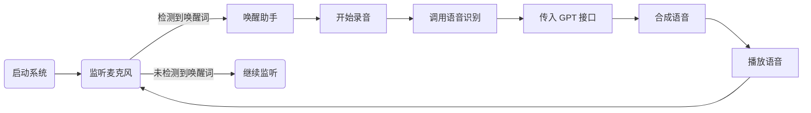

# 👂 主监听模块（listener）

## 模块简介
本模块负责持续监听用户语音输入，判断是否需要唤醒 AI 助理、调用 GPT 模型、控制外设等。它是语音系统的核心调度器，协调语音识别（voice_core）与智能应答（chatgpt_interface）。

---

## 核心功能
- 被动监听麦克风音频
- 唤醒词识别（如“小Z”、“贾维斯”）
- 动态判断是否进入交互模式
- 转录语音、传递给 GPT 模型
- 播放返回结果
- 支持“睡眠”、“静音”、“重启”等语音指令

---

## 工作流程


---

## 推荐依赖
- `sounddevice` or `pyaudio`
- `voice_core.stt`（语音识别）
- `voice_core.tts`（语音合成）
- `chatgpt_interface`（处理对话）
- `threading`, `time`

---

## 使用示例
```python
from listener import start_listener
start_listener()
```

---

## 开发计划
- [x] 持续监听音频
- [x] 唤醒词检测机制
- [x] 与 GPT 模块联动
- [x] 支持语音播报结果
- [ ] 多房间监听管理器
- [ ] 离线模式自动切换
- [ ] 可训练唤醒词
