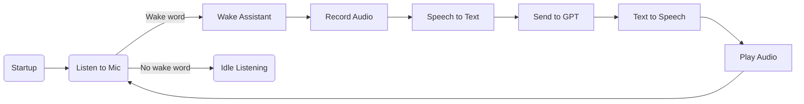

# 👂 Main Listener Module (listener)

## Module Overview
This module listens to microphone input in real time, detects wake words, activates SmartDormAI, and routes voice input to GPT. It acts as the controller between `voice_core`, `chatgpt_interface`, and external hardware.

---

## Core Features
- Passive audio listening
- Wake word detection (e.g., "Xiao Z", "Jarvis")
- Activates assistant on trigger
- Transcribes voice to text and sends to GPT
- Speaks response back to user
- Supports voice commands: "sleep", "mute", "restart", etc.

---

## Workflow


---

## Recommended Dependencies
- `sounddevice` or `pyaudio`
- `voice_core.stt` and `voice_core.tts`
- `chatgpt_interface` (to send/receive replies)
- `threading`, `time`

---

## Example Usage
```python
from listener import start_listener
start_listener()
```

---

## Development Roadmap
- [x] Continuous microphone listening
- [x] Wake word detection
- [x] GPT message routing
- [x] Response playback
- [ ] Multi-room listener manager
- [ ] Auto offline/online switch
- [ ] Custom wake word training
